# Renesas CK-RX65N (blue PCB) Quickstart Guide

***NOTE:*** this guide assumes you have E2 Studio installed. If you didn't - please follow instructions to install if from [here](DEVELOPER_GUIDE.md)

## Download binaries

//TODO: change link when binaries will get moved somewhere else
[Download portal](https://files.witekio.com/)

## Open E2 Studio

## Importing binaries

### Close Welcome view

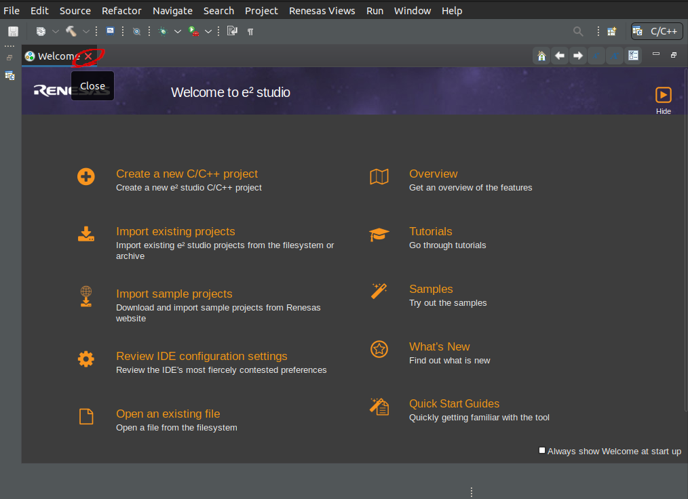 

### Import C/C++ project

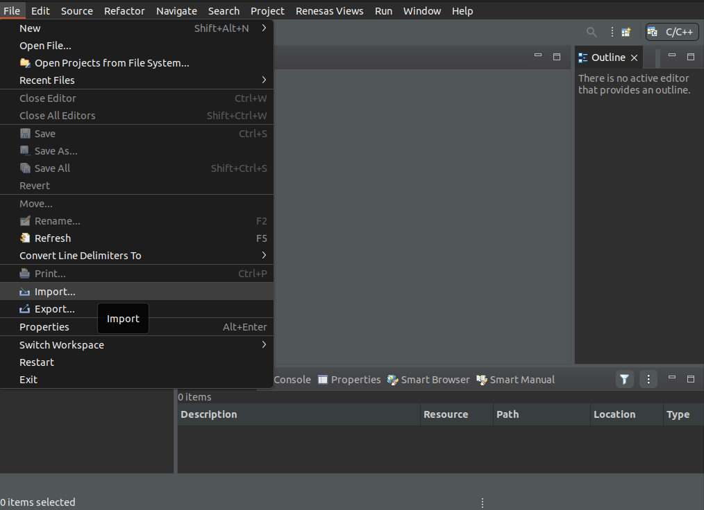
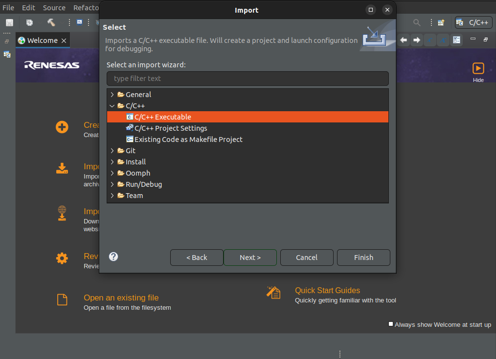

### Click "Browse" button and provide path to downloaded binaries and proceed.

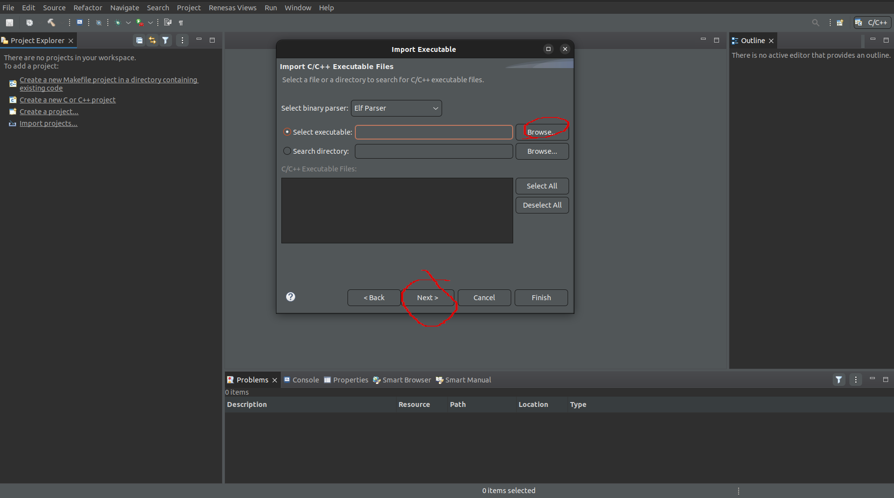

### Click "Finish"

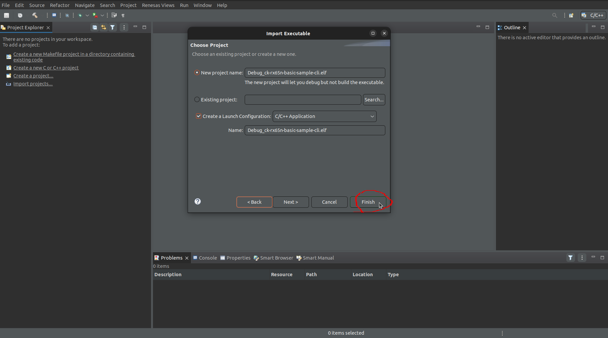

### Close opened window

## Setup the CK-RX65N board

[Setup the CK-RX65N](https://www.renesas.com/us/en/products/microcontrollers-microprocessors/rx-32-bit-performance-efficiency-mcus/ck-rx65n-cloud-kit-based-rx65n-mcu-group).

Connect the two USB-micro leads and the ethernet cable:
***Note:*** both USB-to-USB_micro must be data transfer cables.

The power LED should be lit. The power LED forms the "-" in the CK-RX65N on the silk-screen on the board, above the fingerprint reader.

### Setup a terminal connection

Install
[termite](https://www.virtual-serial-port.org/articles/alternative-to-termite-terminal/), or
[Tera Term](https://ttssh2.osdn.jp/index.html.en), or
[picocom](https://linux.die.net/man/8/picocom), 
or a similar terminal application.

The terminal settings to connect are:

- Chose appropriate COM port. Note: In Linux the terminal may enumerate as
  `/dev/ttyACM0`.
- 115200 baud rate
- 8-bit data
- No parity

## Creating Debugging Setup and Flashing the board

Right click on your project in Project Explorer Tab (typically on your left side)-> Debug As -> Debug Configurations... 

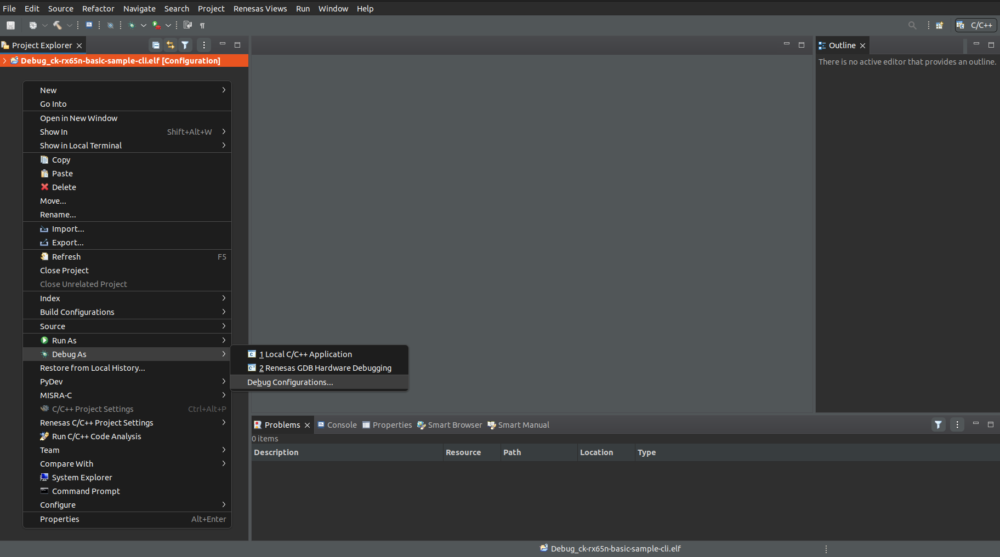

Double click Renesas GDB Hardware Debugging -> it should create new debug setup instance.

In newly created debug instance check that:

In "GDB settings" tab:
- "Debug Hardware" is set to "E2 Lite (RX)";
- "Target Device" is set to "R5F565NE" (for ck-rx65n (blueboard));

 
 Click to see screenshot of setup 

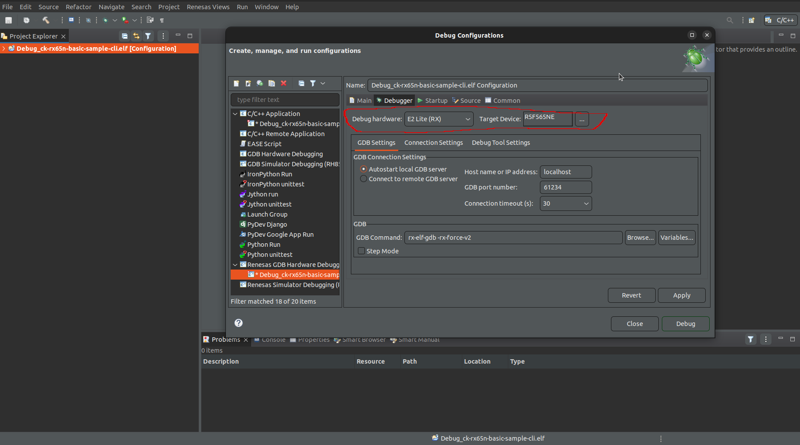

In "Connection Settings" tab:

"Connection type" is set to "Fine".

Apply -> Debug

 
 Click to see screenshot of setup 

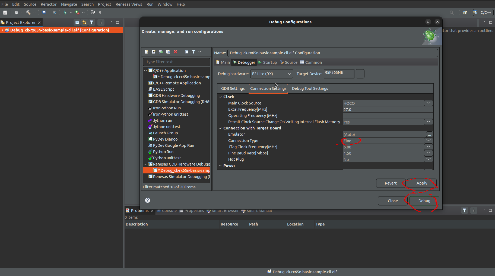

It should start flashing the board.

**If it started successfuly you should be able to see this:**
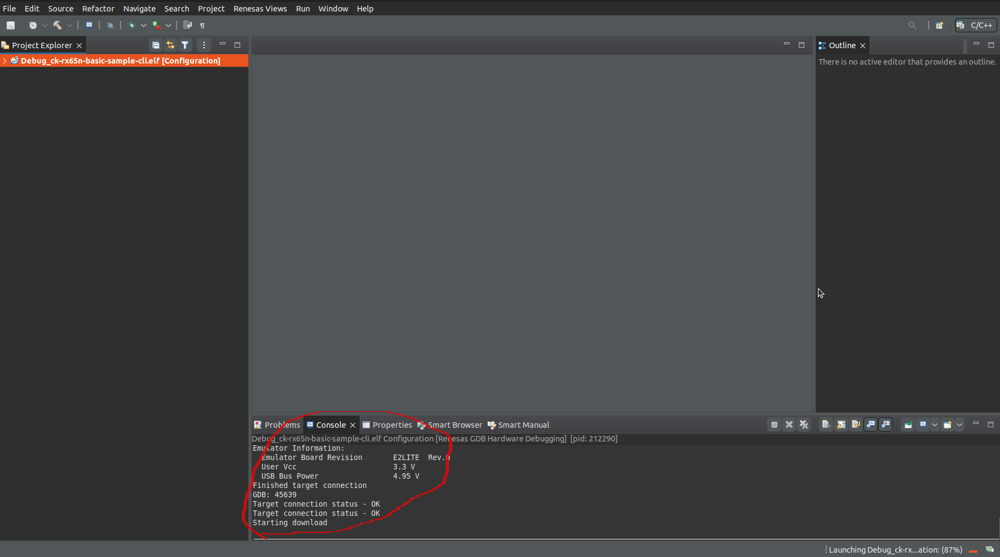

Switch to the debug perspective when prompted.

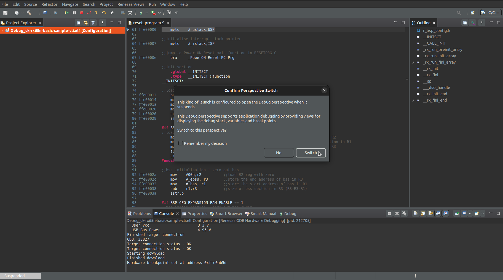

The build will have two default breakpoints already enabled, so presume the
Resume button (green "left-pointing triangle") in the middle of e2
studio twice to enable to code to execute past those two breakpoints.

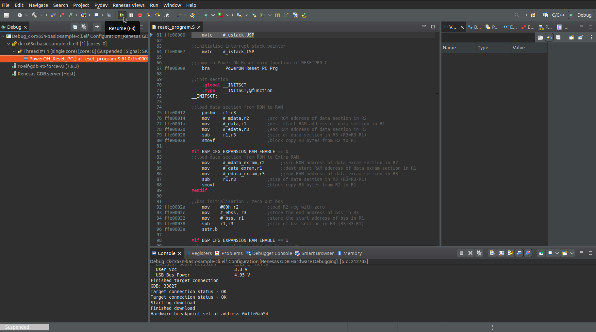

Output should be visible in any attached terminal now.

When finished press the Terminate button (red "square") next to the Resume
button.

To debug again, press the debug button.

To return to C/C++ development, select the "Window", then "Perspective", then
"Open perspective", then "C/C++ project".

To return to debugging/running, select the "Window", then "Perspective", then
"Open perspective", then "Debug".

## Using CLI

After successful boot and network configuration (automatic process) you will be prompted to enter IoTConnect connection details

 Click here if you do not have a device on IoTConnect to enter details of 

## Create a sequence of 16-64 random bytes that are Base64 encoded - for use as a Symmetric Key

To create a random symmetric "key" we will generate a random 32 byte sequence
and then Base64 encode it – so that the binary values can be shared easily.

Run this command in a shell, e.g. in Git for Windows Bash, Cygwin, etc.:

    dd if=/dev/urandom bs=32 count=1 status=none | base64

A symmetric key is used to both encode and decode - so the same key is used on
the IoT device and on the IoTConnect server.

Make a note of this output, as it will be used to setup the IoTConnect template
for the device on the IoTConnect dashboard – and in the application use. 
This is important as isn’t possible to recover key information once
added to the IoTConnect dashboard.

In this case the symmetric key is:

    YzlgdRbYcreYW1fhjwxO4b3X7hBlDY3OVuw6q9wDbAo=

## IoTConnect device

For further information, please consult the [Knowledge Base](https://help.iotconnect.io) which can be found
on the left side of the IoTConnect dashboard in the "Resources" section.

 
 Click to see template creation 

### Create IoTConnect template

Log into your IoTConnect account and open the appropriate Device page which can
be found on the left side of the IoTConnect dashboard.

The template page can be selected by using the "Templates" tab at the bottom of
the page.

Press "Create Template" at the top right corner of the page to create a new
template.

When creating the template choose a unique name for the "Template Code" (which
is a maximum of 10 characters and must start with a letter) and a useful
description in the "Template Name".  Choose "Symmetric Key" for the
"Authentication Type" and choose "2.1" for the "Device Message Version".

When the template is saved, we can add attributes – "measurements" (and types)
– for values that will be sent by the ck-rx65n board.

Click "Attributes (0)" and add a "version" attribute with STRING type and "Save" it.

Add a second "button" attribute with BOOLEAN type, a third "temperature" attribute with
DECIMAL type, and a fourth "humidity" attribute with DECIMAL type.

Note: in the ck-rx65n basic-sample the attribute values are sent using
`iotcl_telemetry_set_xxx()` style commands.

Make a note of the template name, as this will be used as the "Template" to
create the IoTConnect device in the next step – but it will be visible in the
drop-down list.

### Create IoTConnect device

Log into your IoTConnect account and open the appropriate Device page which can
be found on the left side of the IoTConnect dashboard.

The device page can be selected by using the "Devices" tab at the bottom of the
page.

- Chose a "Unique Id" for your device – this will be asked to be entered as `DUID`
  built/compiled in the device later.
- Chose a "Display Name" for your device.
- Select an appropriate "Entity" – this is a pre-populated menu item.
- Select the "Template" display name that was created in the previous step or was already defined –
  this will require filling in extra fields "Primary Key" and "Secondary Key".
- Use the symmetric key that was generated previously, including any trailing
  "=" signs, e.g. `YzlgdRbYcreYW1fhjwxO4b3X7hBlDY3OVuw6q9wDbAo=` as the value
  for the "Primary Key" and the "Secondary Key".

When I created the template I pasted the same value in both the
"Primary Key" and the "Secondary Key" and included the trailing "=" equals
sign.

 
 Acquire CPID and ENV parameters 

`CPID` and `ENV`- can be aquired by going to IoTConnect Dashboard -> Settings -> Key Vault
You should be able to see `CPID` and `Environment` fields in the top part of the screen:
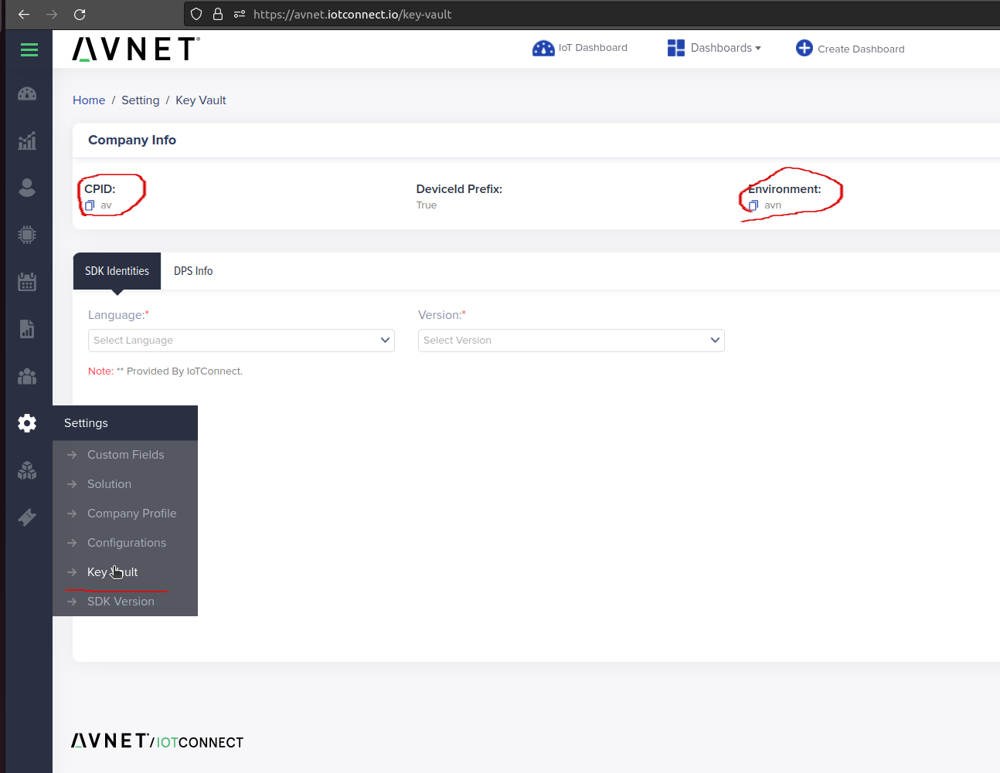

`SYMMETRIC_KEY` is the key you've saved when you were creating new device on IoTConnect dashboard. Should be entered fully (with trailing "=" signs)

`DUID` - Unique ID used in creation of device on IoTConnect dashboard

***Please note:*** current version (07/09/2023) does not allow erasing whatever was typed in, so be careful. If typo was made - you'll need to reboot the board and start anew.

Example expected behaviour:
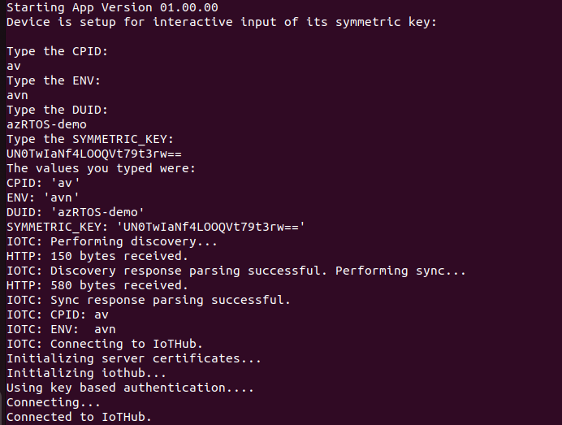
