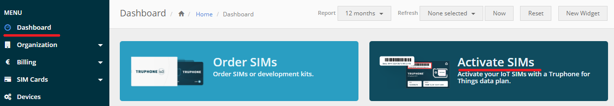
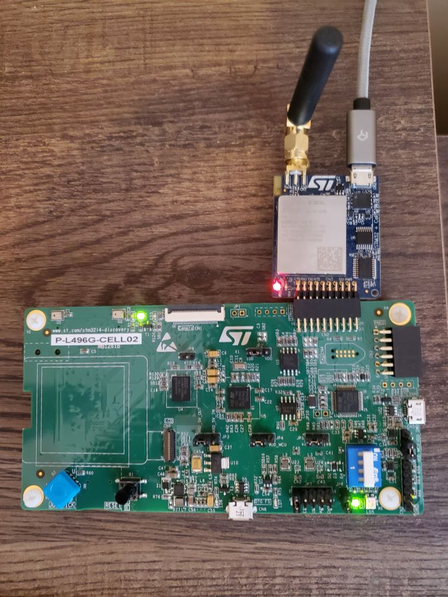
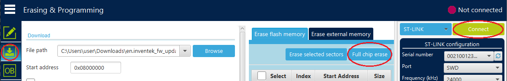
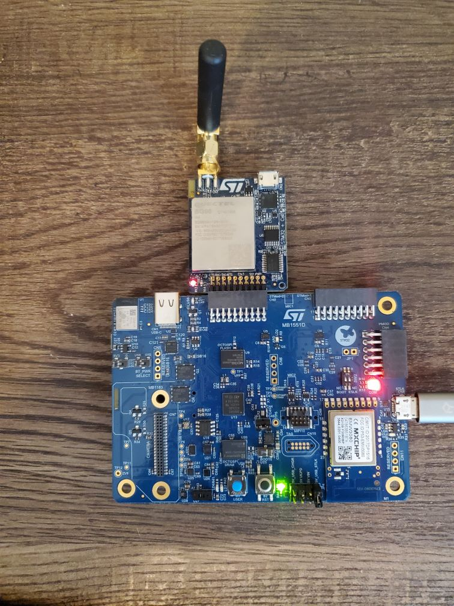

## Introduction
This document is a guide on how to set up your BG96 modem so that it can work with the
STM32U5 board. The supported modem is BG96 that comes as a module along with the STM32L4 board in the
[P-L496G-CELL02 Combo](https://www.st.com/en/evaluation-tools/p-l496g-cell02.html)

The modem has been tested with LTE-M Truphone sims in the USA region.

### Obtaining and Activating Truphone SIM Cards

LTE-M Truphone sims can be purchased from DigiKey as product ID 
[SIM-S-IO3-TRI-2-LP](https://www.digikey.com/en/products/detail/truphone-limited/SIM-S-IO3-TRI-2-LP/11568181).

Once you have obtained the sim card, follow these steps to activate it:
* Create an account or log in at the [Truphone Sign up page](https://account.truphone.com/register)
* Activate your SIM from your account's dashboard page and following the steps outlined in the activation process. 
See the screenshot below.

### Upgrade the Modem Firmware
The software will not work with the firmware that is loaded at the factory on the BG96.
A firmware upgrade is required. Please follow the steps below to upgrade the firmware.

* Download and extract the *[TBD](package/link)* package. 
* Navigate to the *Driver* directory and run *setup.exe* as Administrator.
* You need to update the B96 firmware with **either*** of the following two steps:

1. Connect the BG96 to the STM32L4 (The board that came with BG96 and NOT the STM32U5)
  to the STMOD Plus connector on the board like on the picture below. Ensure that the USB cable
  is **plugged into he BG96** and not the main module.

2. Or, you can also use the STM32U5 for the upgrade, but the board must not 
    be running any software in order to not interfere with the BG96 update. 
    So open the STM32CubeProgrammer IDE, connect it to the U5 board and erase 
    it (see screenshot below). Then you can connect to BG96 module to the 
    STM32U5 board's STMOD+2 (CN2) connector (screenshot further down below),
    however ensure that the USB cable is plugged into the BG96 module and **not** the U5 board.

* Upgrade the board by running the *Update.bat* script in the downloaded package.
* Connect it to the STM32U5 board's STMOD+2 (CN2) connector 
like on the picture below. In this case, the USB cable should be connected to the STM32U5.

* It may take some time for the board to connect for the first time.
